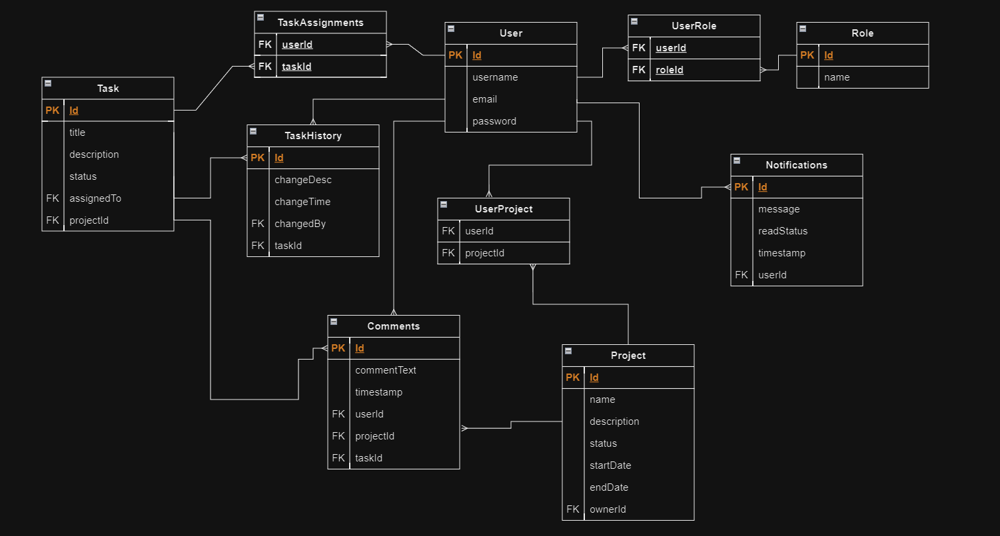

# ProjectX
A brief description of what this project does and who it's for

## Description
ProjectX is a project management platform that allows users to manage, collaborate and track projects and tasks. It includes a robust authentication and authorization system, with different levels of access based on roles.

## Objective
Objective:
To develop a complete platform that allows users to manage projects and tasks with different permissions, using a modular and scalable architecture.

## Entity-relationship diagram

